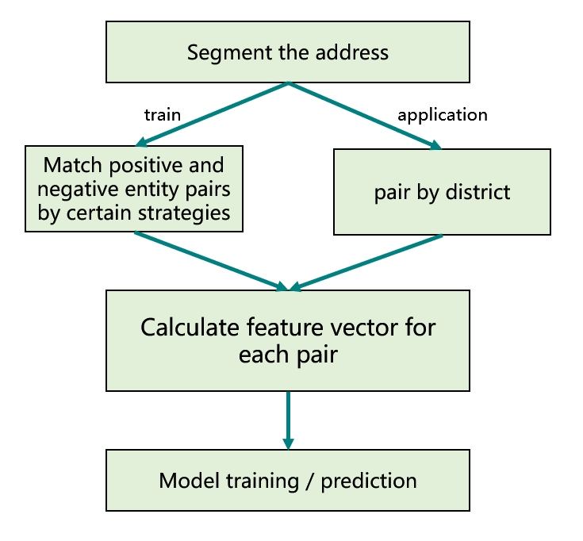
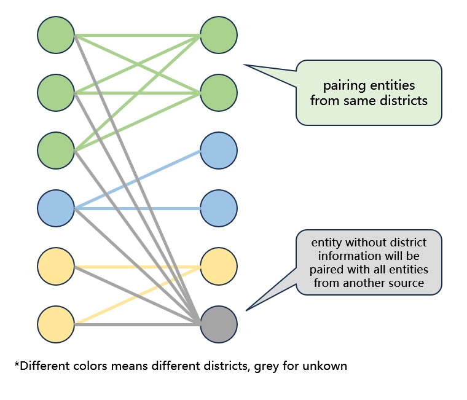
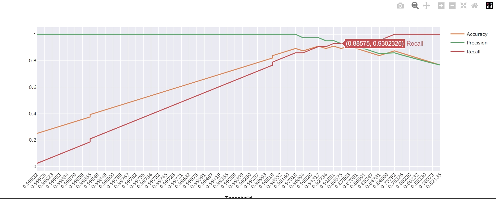

# Entity Matching For Tourism Dataset

## 1 Description

Imagine searching for hotels from two tourism websites. There should be many same hotels but with slightly different information in names or addresses. So, if we are conducting a big data processing task in the field of tourism, like building a knowledge graph, we are likely to face the problem that entities from different data sources are either same or different. When we need to integrate these data, it is important to find the same entities and remove duplicates. The figure below shows the main function of this entity matching model.

<!--  -->
 
   

The model is a Xgboost-based binary classification model. When encoded vectors of two entities come into the model, it will give the prediction label *same / different*.

## 2 Dataset and Features

Data in this project are from three sources - Ctrip, Tripadvisor, Mafengwo. And we take attractions in Hong Kong as a example. For each entity (attraction), we keep attributes of **name**, **address**, **location** (latitude and longitude), and **District**. The addresses will be segmented by a BERT-based model and divided into attributes **district**, **RoadInfo**, **RoomInfo**, and **Poi** (Details in address segment will not be displayed in this project). We have to mention that the attributes **District** and **district** are different. The former one comes from the tourism website and indicates the administrative district, whereas the latter one is a part of the address and includes administrative district / village / town / block. Moreover, the former one will only be used in entity pairing and the latter one will be one of the feature vectors.

## 3 Overall Process

The overall process will include 3 main stages - making training data / pairing application data, calculating feature vectors, model training / prediction, which is shown as below:

 
   

 Specifically, there is a strategy in entity paring to reduce the calculaation complexity. Clearly, entities in different districts must not be matched as a same one. In other words, we only need to pair entities from same districts. This strategy is shown as below:

  
   

## 4 Data Preprocessing

The preprocess of data is divided into 2 stages - making **training** data / pairing **application** data, as mentioned before (The vector calculation part is also included here). They correspond to the four folders 'train_xxx' and 'user_xxx' respectively. When both sets of data are processed, the model can be trained and predicted using **main.ipynb**.

### 4.1 Training data

1. There are only two source data files in the initial data directory **'train_data'**
2. Utilising external address segment models, we get two segment results in address, namely **'xxx_addr_result.json'**
3. Run **'preprocess.ipynb'** in **'train_src'** to process the address segment results, simplify the information from source data, and combine them. So we get two processed data with segmented address, namely **'xxx_addr.json'**
4. Run **'matching.ipynb'** to pair the entities from 2 different sources by some strategies. Then we get positive and negative training data files.
    1. Calculate all embedding vectors for each strings in 2 source data in advance.
    2. Generate 200 pairs of entities with the most similar **Name** -> Manually label them (you need to find the corresponding .csv in the **temp** folder and add a column of 'label' to manually mark 1/0 (indicating match/mismatch)) -> Extract positive and negative data
    3. Same operation for **Distance**
    4. Same operation for **RoadInfo**
    5. Same operation for **RoomInfo**
5. Run **'embedding.ipynb'** to calculate the similarity of strings and convert to Dataframe.

### 4.2 Application data

1. There are only two source data files in the initial data directory **'user_data'**
2. Utilising external address segment models, we get two segment results in address, namely **'xxx_addr_result.json'**
3. Run **'preprocess.ipynb'** in **'user_src'** to process the address segment results, simplify the information from source data, and combine them. So we get two processed data with segmented address, namely **'xxx_addr.json'**
4. Run **'match&embedding.ipynb'** to pair the entities by 18 districts and calculate the vectors. We get **'data.csv'**

## 5 Model training / precition

1. Run **'main.ipynb'** in the main folder to get prediction result of test set **'test_result.csv'** and prediction result of application set **'result.json'**
2. Run **'visualization.ipynb'** to decide the decision threshold according to the line chart

It should be explained more here. The decision threshold means that if we set it as x, for entity pairs with a bigger predition possibility (TRUE label) than x, we regard these pairs of entities as matched ones. Otherwise they will be predicted as unmatched entities.

As the line chart shown below, the metrics **Accuracy**, **Precision**, and **Recall** keep changing with change of threshold. So, to balance these three metrics, we tend to choose 0.98619 as a good decision threshold for a better performance.

  
   

## 6 Expriment Results

With regard to the training data, the manually labelling details are shown below:

|          | Name | Distance | RoadInfo | RoomInfo | Sum |
| -------- | ---- | -------- | -------- | -------- | --- |
| positive | 138  | 4        | 17       | 1        | 160 |
| negative | 62   | 196      | 83       | 19       | 360 |
| Sum      | 200  | 200      | 100      | 20       | 400 |

After training, the prediction accuracy for test set is 0.9385 and the feature importance is shown below:

| Location | Name  | Address | District | RoadInfo | Poi   | RoomInfo |
| -------- | ----- | ------- | -------- | -------- | ----- | -------- |
| 0.251    | 0.599 | 0.060   | 0.0535   | 0.055    | 0.000 | 0.000    |

## 7 Future Work
1. There is only one method to calculate the string similarity. It can be extended by many other methods to increase the number of features for the model to decide during training.
2. We only segment the address information. The attraction name also could be segmented for better performance.
3. In the process of training data, it needs manually labelling a lot of data, especially for the source data with thousands of entities. It is better to reduce the manual tasks there.