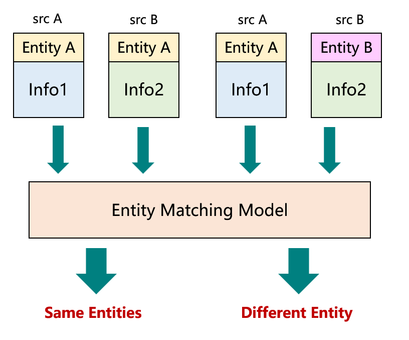

# Entity Matching For Tourism Dataset

## 1 Description

Imagine searching for hotels from two tourism websites. There should be many same hotels but with slightly different information in names or addresses. So, if we are conducting a big data processing task in the field of tourism, like building a knowledge graph, we are likely to face the problem that entities from different data sources are either same or different. When we need to integrate these data, it is important to find the same entities and remove duplicates. The figure below shows the main function of this entity matching model.

The model is a Xgboost-based binary classification model. When encoded vectors of two entities come into the model, it will give the prediction label *same / different*.

## 2 Dataset

Data in this project are from three sources - Ctrip, Tripadvisor, Mafengwo. And we take attractions in Hong Kong as a example. For each entity (attraction), we keep attributes of name, address, location (latitude and longitude), and district.

任务的数据处理分为**训练**和**应用**两步，分别对应“train_”和“user_”四个文件夹。当两组数据都处理完毕时，通过main.ipynb进行模型训练和预测。

（总体架构见[https://www.yuque.com/gggyyy/cs4yt9/gn9axe7un83qyno2]）

## 首先看训练数据处理过程

1. 初始数据目录（train_data）下只有两个数据源文件
2. 通过外部的分词模型预测，得到两个源数据的地址分词结果，以“xxx_addr_result.json”命名
3. 运行代码目录（train_src）下的preprocess.ipynb。处理分词结果，精简源数据的信息，合并两者，得到两个加工后的带地址数据，以“xxx_addr.json”命名
4. 运行matching.ipynb。通过多种方式将两个源的数据两两配对，生成positive和negative正负数据文件
    1. 预处理出两个源数据中所有字符串的词向量
    2. 生成Name最相似的200对实体 -> 手动对其打标（需要在temp文件夹里找到对应的csv，添加一列label手动打标1/0（表示匹配/不匹配）） -> 提取pos和neg数据
    3. 对Distance做相同操作
    4. 对RoadInfo做相同操作
    5. 对RoomInfo做相同操作
5. 运行embedding.ipynb。对两个数据进行相似度计算，转换为DataFrame

## 其次是应用数据处理过程

1. 初始数据目录（user_data）下只有两个数据源文件
2. 通过外部的分词模型预测，得到两个源数据的地址分词结果，以“xxx_addr_result.json”命名
3. 运行代码目录（user_src）下的preprocess.ipynb。处理分词结果，精简源数据的信息，合并两者，得到两个加工后的带地址数据，以“xxx_addr.json”命名
4. 运行match&embedding.ipynb。将两个源的数据按照18个区进行同区两两匹配，然后对于每对数据进行词向量计算（使用应用数据预处理好的），得到“data.csv”文件

## 最终是模型训练与预测

1. 运行主目录下的main.ipynb。得到测试集预测结果“test_result.csv”和应用数据预测结果“result.json”
2. 运行visualization.ipynb。根据折线图决定最优阈值